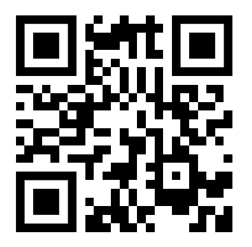
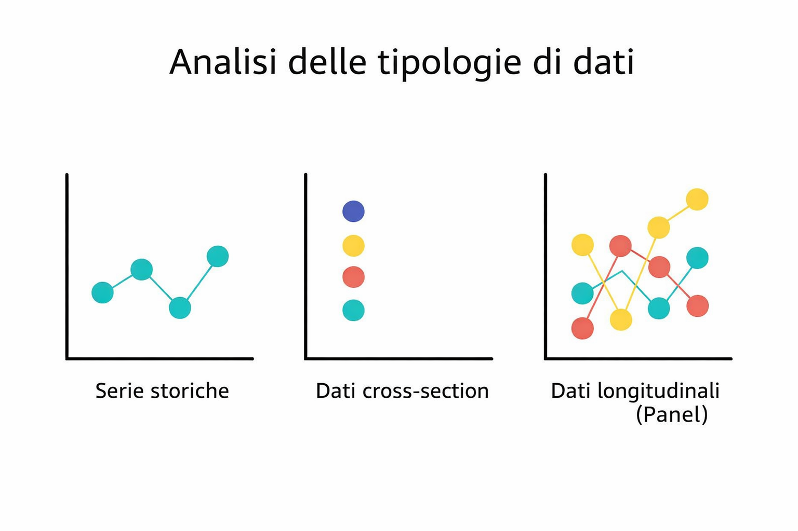

```{r setup, include=FALSE}
library(knitr)
library(kableExtra)
knitr::opts_chunk$set(echo = FALSE,warning = FALSE)
```

# Il Materiale

<div style="text-align:center;">
  
</div>

La pagina del corso [ix-pat.github.io](https://ix-pat.github.io/) ospita

- Gli [appunti](https://ix-pat.github.io/appunti/index.html): il canovaccio che seguirò durante le lezioni
- Gli [esercizi](https://ix-pat.github.io/esercizi/index.html): divisi per tipologia + le prove passate
- Il materiale concesso per l'esame 
  - [formulario](https://ix-pat.github.io/formulario23.pdf)
  - [tavole statistiche](https://ix-pat.github.io/tavole-statistiche.pdf)
- Informazioni, webapps, e molto altro

---

# Struttura del corso

- Statistica Descrittiva
  - faremo ordine in cose note (tabelle, percentuali, medie, ecc.);
  - può sembrare semplice;
  - rischio di sottovalutare l'impegno.
- Probabilità
  - momento dello smarrimento;
  - la teoria di base è semplice e lineare, gli esercizi sembrano complicati, anche quando la soluzione è veloce;
    - i giochi di sorte sono la metafora della casualità intrinseca nella natura
    - il lancio di due dadi, di tre monete truccate, un'estrazione da un'urna con palline di numero diverso;
    - gli esercizi sui giochi di sorte, per essere risolti, richiedono di tradurre la storia in sequenza di ragionamenti formali sulla base di regole.
  - la successiva formalizzazione può disorientare chi ha debole propensione all'astrazione e nell'uso del linguaggio simbolico.
    - Tanti dadi, tante monete, urne sempre più piene di palline, sequenze di urne.
- Inferenza (statistica)
  - La statistica e la probabilità si fondono per descrivere e prevedere alcuni fenomeni, anche in caso di informazione parziale;
  - la teoria è molto complessa, gli esercizi semplici perché procedurali, anche se lunghi e macchinosi;
  - gli ultimi argomenti incastrano tutti gli argomenti trattati e si presentano come strumento operativo per l'analisi di molti fenomeni concreti.


# L'Esame

- Prova scritta **obbligatoria**:
  - Durata di 90 minuti
  - 6 raggruppamenti di esercizi
  - Formulario ufficiale, tavole statistiche e calcolatrice scientifica
- **Non** è prevista prova orale

# Struttura dell'esame

Argomenti               | Raggruppamento esercizio
------------------------|----------------------------
Statistica Descrittiva  | 1 (4 esercizi)
Probabilità             | 2 (4 esercizi), 3 (1 esercizio)
Inferenza               | 4 (4 domande), 5 (1/2 esercizi), 6 (5 esercizi)

- La sufficienza si ottiene svolgendo il primo esercizio di ciascun raggruppamento
(con l'eccezione del raggruppamento 4).
- I punteggi degli esercizi successivi sono più bassi e si sommano per determinare il voto finale.
- Le domande di teoria sono spesso formulate come piccoli esercizi, risolvibili in poche righe se la teoria è ben compresa.
- Uno o due esercizi che richiedono di ragionare oltre gli schemi standard, usando gli strumenti del corso, distinguono il 30 dal 30 e Lode.


# Consigli per lo studio

- Presenza in aula;
- Sistemazione degli appunti nella giornata stessa;
- Cercare colleghi per gruppi di studio;
- Cercare di dipanare ogni dubbio prima della prossima lezione;
- Non studiare dagli esercizi: prima fissare la teoria **dopo** l'esercizio.

# Le lezioni

- Questa lezione è a slides
  - Introdurrò alcuni concetti di base
  - Alcune definizioni operative
- Dalla prossima lezione scriverò sulla Wacom, in modalità lavagna
  - scriverò a mano, passo-passo, gli sviluppi della teoria e le soluzioni degli esercizi 
  - scrivere insieme a me, durante la lezione, eviterà di riscrivere dopo
- Portate una calcolatrice scientifica


# Cos'è la Statistica?

- È difficile dare una definizione sintetica.
- Per ragioni storiche e culturali, la lingua italiana non ha interiorizzato pienamente alcuni concetti statistici moderni.
- La disciplina moderna nasce e si sviluppa soprattutto nel contesto dell'empirismo anglosassone.
- L'etimologia aiuta poco:
  - *statistica* ← *status*
  - originariamente: dati dello Stato, descrizione amministrativa e demografica.
- Oggi la statistica è molto altro ed è la scienza che per oggetto di studio i dati, dalla loro produzione alla loro analisi.


# Cos'è la statistica? (una definizione)

<div style="display:flex; gap:2rem;">
<div style="flex:1; font-size:0.92em;">


> Statistics is the art and science of designing studies and analyzing the data that those studies produce. Its ultimate goal is translating data into knowledge and understanding of the world around us. In short, **statistics is the art and science of learning from data**.

</div>
<div style="flex:1; font-size:0.92em;">


> La statistica è l'arte e la scienza di progettare studi e di analizzare i dati che tali studi producono. Il suo obiettivo finale è tradurre i dati in conoscenza e comprensione del mondo che ci circonda. In sintesi, **la statistica è l'arte e la scienza di apprendere dai dati**.

</div>
</div>

> *Agresti, A., and Franklin, C. (2007), Statistics: the Art and Science of Learning from Data, Upper Saddle River, Pearson Prentice Hall.*

---

# Dato e dati

- **Dato**  
 In latino *datum* significa ciò che è dato, un fatto, un evento osservato.
  - Michele a fine marzo del 2023 era disoccupato in cerca di lavoro da 143 giorni.
  - Mario nel febbraio del 2024 è stato ricoverato per 4 giorni al Maggiore di Bologna.
  - Il lotto 283719 prodotto il 3 dicembre del 2025 è risultato difettoso.

- **Dati**  
I dati sono collezioni strutturate di fatti osservati, codificati in modo opportuno, che descrivono un fenomeno.
  - Lo stato lavorativo delle forze lavoro nel primo trimestre del 2023
  - le durate dei ricoveri ospedalieri in Emilia Romagna
  - Lo stato dei lotti prodotti dal primo gennaio del 2025

---

# Fenomeni e fenomeni collettivi

- **Fenomeno** dal greco φαίνεσθαι [faˈinestʰai]: ciò che appare.
  - la formazione delle nuvole;
  - l'oscillazione di un pendolo;
  - la riproduzione;
  - l'invecchiamento.

- **Fenomeno collettivo**  
Quando lo studio riguarda una pluralità di elementi simili tra loro, parliamo di fenomeno collettivo.
  - la denatalità;
  - l'invecchiamento della popolazione;
  - il comportamento dei consumatori;
  - il traffico urbano.

---

# Dati, fenomeni, variabilità, descrizione e previsione


- **Fenomeno collettivo**: riguarda molte unità simili (persone, imprese, comuni, transazioni, misure ripetute…)
- La statistica offre concetti, metodi, e strumenti per individuare:
  - **regolarità** (tendenze d'insieme)
  - **variabilità** (quanto e come cambiano le unità)
  - e usa entrambe per **descrivere** e **prevedere**

<!-- --- -->

<!-- # Descrizione e previsione -->


- **Obiettivo conoscitivo**  
Mira a comprendere l'andamento generale di un fenomeno collettivo, distinguendo ciò che è regolare da ciò che varia tra le unità.
$$
\text{Fenomeno}=\text{Spiegazione}+\text{Variabilità} 
$$


- **Obiettivo predittivo**  
Le regolarità osservate possono essere impiegate per formulare previsioni su casi non osservati; la variabilità quantifica il margine d'errore.
\[
\text{Futuro}=\text{Previsione}+\text{Errore}
\]

---

# Unità statistica e variabile

- Si definisce **unità statistica** l'entità su cui rilevare una o più informazioni
  - un singolo individuo in un'indagine sul reddito; 
  - un paziente in uno studio epidemiologico; 
  - una famiglia in un'indagine sui consumi; 
  - un'impresa in uno studio sugli investimenti; 
  - un comune nel rilevare indicatori demografici; 
  - un componente prodotto in uno studio sulla qualità industriale.
- Su ogni unità statistica viene rilevata una o più **variabili statistiche**
- Si definisce **variabile statistica** l'aspetto dell'unità statistica che si osserva o misura.
  - il reddito in euro; il titolo di studio; gli anni di lavoro;
  - lo stato della malattia; giorni di degenza; farmaci presi;
  - i consumi in euro; la percentuale spesa in alimentari; il numero di componenti;
  - l'entità dell'investimento; la ripartizione dell'investimento; 
  - il numero di nati nel 2024; il numero dei decessi nel 2024; il bilancio dei pagamenti
  - stato del pezzo: rispetta gli standard oppure no; dopo quanti giorni di utilizzo si è guastato;

---

# Popolazione statistica: finita e infinita

- Si definisce **Popolazione Statistica** l'insieme di tutte le unità statistiche di riferimento.
- Le unità statistiche sono accomunate da caratteristiche comuni e variano rispetto ad altre.
  - tutti i residenti in Italia ad una certa data;
  - tutti malati di una certa malattia;
  - tutte le famiglie di cui almeno uno dei membri è immigrato;
  - tutti i comuni dell'Emilia-Romagna;
  - tutti i pezzi prodotti nel 2024
- La popolazione può essere **finita** o **infinita** 
- popolazione è **finita** quando il numero delle unità è noto e determinabile e se ne possiede un **elenco**.
  - aventi diritto al voto;
  - gli iscritti all'anagrafe italiana;
  - le imprese iscritte alla Camera di Commercio alla provincia di Modena.
- Una popolazione è **infinita** quando il numero delle unità non è noto o non è delimitabile in modo preciso
  - i consumatori di una certa marca;
  - i malati di COVID in Italia nel 2025;
  - le imprese che adottano una determinata tecnologia;

---

# Tipi di variabile

La variabili possono essere di molti tipi, soffermeremo l'attenzione sulle principali:

- **Qualitativa**
  - *sconnessa* (nominale): genere, stato civile, settore di occupazione, genere musicale preferito
  - *ordinata* (ordinale): titolo di studio, preferenze, giudizi
- **Quantitativa**
  - *discreta*: numero di incidenti, voto di laurea
  - *continua*: reddito, misure di lunghezza, capienza e peso

---

# Modalità di una variabile

Ogni variabile è suscettibile di assumere valori diversi, chiamati **modalità**.

- Genere: {F, M} 2 modalità;
- titolo di studio: {Elementari, Medie, Superiori, Lauera, Post Laurea} 5 modalità;
- voto all'esame di Statistica: {0,1,...,29,30,30L} 32 modalità;
- numero di automobili in famiglia {0, 1, 2, 3, ..., ?}; quante modalità?
- Statura espressa in cm {0,1,...,180, 181,..., 213,...?}
- Statura espressa in mm {0,1,...,1800, 1801,..., 2130,...?} il numero esplode.
- Reddito annuo espresso in euro {0.00, 0.01,..., 1.00,..., 1 200,..., 12 000,...,500 000, 1 000 000,...?}

---

# Origine dei dati: sperimentali e osservazionali

Le evidenze empiriche su cui lavora la statistica possono essere

- **Sperimentali**: l'osservazione è guidata da un disegno.
  - doppio cieco in farmacologia; 
  - disegni sperimentali in agricoltura;
- **Osservazionali**: si osserva “ciò che accade” senza intervenire direttamente, e poi si cerca struttura/relazioni nei dati.
  - Studi su reddito e consumi;
  - Ricerche di mercato;
  - Studi sanitari retrospettivi;

---

# I dati economici

L'economia combina modelli teorici ed evidenze empiriche e spesso i dati sono **osservazionali**.

Esempi di grandezze tipiche: 

- prezzi; 
- redditi; 
- occupazione; 
- produzione; 
- consumi;
- educazione
- stili di vita
 
---

# Censimento e campionamento

- **Censimento**: osservare tutte le unità della popolazione. 
- **Campionamento**: osservare una parte e generalizzare alla popolazione.
- Il censimento è spesso impraticabile per costi/tempi/complessità. 
- Il campionamento è la via ordinaria, ma richiede disegno e controllo della qualità.
  - Le indagini ufficiali sono spesso da popolazioni finite; 
  - si disegnano strategie di campionamento complesse (strati, grappoli, probabilità variabile);
  - si estraggono campioni dalle liste (anagrafe, liste elettorale, ecc.);
  - si procede con la raccolta dei dati.

---

# Le principali istituzioni statistiche Nazionali e Internazionali

- **ISTAT**   
L'Istituto nazionale di statistica.
Raccoglie, produce e diffonde i dati ufficiali sull'Italia tramite censimenti e indagini campionarie, descrivendo i fenomeni demografici, sociali ed economici del paese.

- **Eurostat**  
L'ufficio statistico dell'Unione Europea.
Coordina gli istituti nazionali di statistica dei paesi membri, armonizza definizioni e metodologie e rende i dati confrontabili a livello europeo.

- **OECD**  
Organizzazione internazionale per l'analisi comparata delle economie avanzate.
Raccoglie e armonizza dati economici e sociali a supporto del confronto tra politiche pubbliche.

- **United Nations**  
Il sistema statistico delle Nazioni Unite.
Coordina la produzione di statistiche a livello globale e definisce indicatori internazionali su popolazione, sviluppo ed economia.

---

# Esempi di indagini

- Forze di lavoro (ISTAT): tasso di occupazione, 77 000 famiglie/trim.
- Consumi delle famiglie (ISTAT): diario spese, 30 000 famiglie/anno
- EU-SILC (Eurostat/ISTAT): redditi e disuguaglianze, >20 000 famiglie
- PISA (OCSE): competenze studenti quindicenni, 11 000 studenti/3 anni
- PIAAC (OCSE): competenze adulti 16-65 anni, 5 000 individui
- TALIS (OCSE): condizioni di lavoro degli insegnanti, 3 000 insegnanti

---

# Struttura temporale dei dati

- **Dati cross section**
Osservazioni su **unità diverse nello stesso momento** (o in un intervallo molto breve).
Forniscono una fotografia del fenomeno.
Esempio: redditi delle famiglie in un dato anno.

- **Serie storiche**
Osservazioni dello **stesso fenomeno nel tempo**, senza seguire le stesse unità individuali.
Descrivono l'evoluzione temporale di una variabile.
Esempio: tasso di disoccupazione mensile di un paese.

- **Dati panel**
Osservazioni su **più unità seguite nel tempo**.
Combinano confronto tra unità e dinamica temporale.
Esempio: redditi delle stesse famiglie osservati per più anni.

---

# Struttura temporale dei dati



# Ricerche di mercato

- Studiano comportamenti e preferenze dei consumatori
- Fonte rilevante di dati economici micro
- Prevalentemente dati osservazionali
- Raccolti tramite questionari, interviste, strumenti digitali
- Spesso dati cross section (fotografia in un dato periodo)

---

# I dati aziendali

- Informazioni prodotte **all'interno delle imprese**
- Nascono per finalità **amministrative, contabili e gestionali**
- Non sono raccolti primariamente per fini statistici
- **Tipologie di dati**
  - Bilanci, conti economici, stati patrimoniali
  - Flussi di cassa, vendite, costi, investimenti
  - Occupazione, retribuzioni
  - Dati operativi: produzione, scorte, tempi, clienti, fornitori

---

# Le banche dati economiche e finanziarie

- Archivi strutturati di **grandi quantità di dati**
- Raccolgono informazioni da **fonti diverse**
- Resi disponibili per **consultazione e analisi**
- **Banche dati finanziarie**
  - Prezzi di azioni, obbligazioni, cambi, materie prime
  - Dati aggiornati in **tempo reale o quasi**
  - Frequenza elevata: giornaliera, oraria, infra-giornaliera
  - Forte **variabilità** legata a informazioni e aspettative
- **Altre banche dati economiche**
  - Archivi pubblici: serie storiche, microdati, indicatori aggregati
  - Dati amministrativi: fiscali, contributivi, registri
  - Archivi privati: imprese, bilanci, commercio, consumi


---

# Big data, dati digitali e dati testuali

- Dati generati **automaticamente o semi-automaticamente**
- Derivano da attività digitali: web, piattaforme, social, pagamenti, dispositivi connessi
   - Elevato volume e frequenza
   - Dati come sottoprodotto di interazioni e processi
   - Click, like, log, testi, immagini, sequenze di eventi
   - **Dati testuali**
   - Documenti, post, commenti, articoli, trascrizioni
   - Non strutturati in origine
   - Trasformati in dati analizzabili tramite codifica e rappresentazioni quantitative
   - Base di molte applicazioni di apprendimento automatico


# Codifica e Strutturta dei Dati

- **Codifica**: riguarda la traduzione del singolo dato in forma operativa:
  - numerica o simbolica;
  - categorie, livelli, codici;
  - convenzioni che rendono i dati memorizzabili e confrontabili.
- **Struttura**: come l'insieme dei dati viene organizzato, rappresentato ed archiviato:
  - può essere molto complesso;
  - esistono molte tipologie di dati diversi e rappresentazioni;
  - osserveremo una struttura tabellare particolarmente comoda, alla quale spesso è possibile ricondursi, ma non sempre:     
  **la matrice dei dati**

# La matrice dei dati

La matrice dei dati è una tabella che consente di raccogliere in modo efficiente molti tipi diversi di dati.

```{r 01-dati-1,echo=FALSE}
set.seed(8)
j <- c(1,2,3,"$n$",5:80)
età <- sample(18:80,size = 4,replace = T)
Sesso <- sample(c("M","F"),size = 4,replace = T)
StatoCivile <- sample(c("Sposato","Non sposato"),size = 4,replace = T)
Titolo <- sample(c("Elementari","Medie","Superiori","Laurea"),size = 4,replace = T)
Reddito <- round(rgamma(4,4,1/5),2)
Figli <- sample(0:5,10,replace = T,prob = c(10,5,2,1,1,1))
Figli[1:3] <- c(2,0,1)

dat <- matrix(nrow = 5,ncol = 7)
dat[1:3,] <- cbind(j,età,Sesso,StatoCivile,Titolo,Reddito,Figli)[1:3,]
dat[4,] <- "$\\vdots$"
dat[5,] <- cbind(j,età,Sesso,StatoCivile,Titolo,Reddito,Figli)[4,]

kable(dat,booktabs = T, escape = F,linesep = "", digits = 4,col.names = c("$i$","Età","Sesso","Stato Civile","Titolo di Studio","Reddito x 1000€","Num. di Filgi"))
```

- **Righe**: unità statistiche (le determinazioni delle variabili per una specifica unità)
- **Colonne**: caratteri / variabili (le modalità osservate sulle unità)

---

# Ricevimento, comunicazioni e raccomandazioni

- Ricevo tutti i giovedì dalle alle (una mail in anticipo è gradita)
- Online su appuntamento (scrivete una mail)
- Amo iniziare le lezioni in orario, e finire, semmai, qualche minuto prima.
  
  